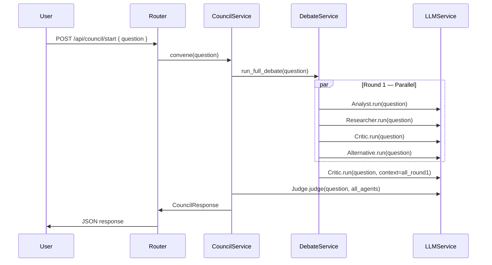

# AI Council — Architecture

## Overview

AI Council is a multi-agent debate system where four specialized AI agents independently analyze a question, a Critic debate round sharpens the analysis, and a Judge produces a final synthesized verdict.

## Flow Diagram



## Agent Responsibilities

| Agent       | Role                    | Key Behavior |
|-------------|-------------------------|--------------|
| Analyst     | Structured Analysis     | Breaks question into dimensions, identifies trade-offs |
| Researcher  | Context & Evidence      | Provides facts, examples, best practices |
| Critic      | Devil's Advocate        | Challenges assumptions, exposes weaknesses |
| Alternative | Alternative Perspectives| Explores unconventional angles |
| Judge       | Final Synthesis         | Weighs all inputs, produces actionable verdict |

## Layer Responsibilities

```
HTTP Request
    ↓
routers/council.py       ← validates input, calls service, handles HTTP errors
    ↓
services/council_service.py  ← top-level orchestration
    ↓
services/debate_service.py   ← manages agent rounds
    ↓
agents/*.py              ← individual agent behavior and system prompts
    ↓
services/llm_service.py  ← provider abstraction (OpenAI-compatible)
```

## Adding a New Agent

1. Create `backend/app/agents/myagent.py` inheriting `BaseAgent`
2. Set `name`, `role`, `system_prompt`
3. Add it to `DebateService.run_round_one()` in `debate_service.py`
4. It will automatically be included in the Judge's context
